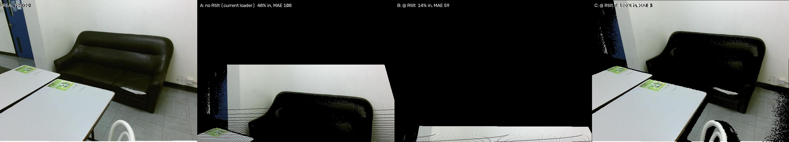

# RGB-D Object Detection for Collision Avoidance

**Thomas Kulch · Darshan Kedari · Wade Williams**
CS 5330: Computer Vision & Pattern Recognition — Northeastern University, Summer 2026

We are building a perception pipeline that converts an RGB-D video stream into a **top-down
Bird's-Eye-View occupancy map** with real-world distances — the representation a robot needs to
decide what it is about to hit. For each frame the system detects and classifies objects in the RGB
image, back-projects the depth map into metric 3D, removes the ground plane so the floor is not
reported as an obstacle, and clusters what remains. Every obstacle on the output map carries a
class, a 3D centroid, and a footprint in meters.

The reason it takes two paths rather than just running a detector: **a detector only finds what it
was trained on.** A COCO-pretrained YOLO11 model labels a chair confidently and goes completely
blind on the cardboard box, the loose cable, or the pallet — and hitting an unlabeled obstacle hurts
exactly as much as hitting a labeled one. So detection and geometry run independently and are then
fused. Recognition says *what* something is; geometry guarantees we still see *that something is
there* when recognition fails. Anything the geometry finds but the detector missed is kept and
labeled `"unknown"` rather than thrown away.

---

## Installing

```bash
git clone <repo> && cd cs-5330-final-project

uv venv && source .venv/bin/activate
uv pip install -e ".[dev]"
```

The base install is deliberately CPU-only and torch-free so it stays fast. Detection and depth
estimation are installed separately, and **the order matters** — CUDA PyTorch must land before
`ultralytics`, or the resolver quietly pulls the CPU-only torch wheel and everything runs slow:

```bash
uv pip install torch torchvision --index-url https://download.pytorch.org/whl/cu121
uv pip install ultralytics onnxruntime transformers

pre-commit install          # shared lint hooks, run automatically on every commit
```

Then fetch the data. Both commands are safe to re-run — they verify what is already on disk by
frame count and skip it:

```bash
python scripts/download_datasets.py sunrgbd            # ~35 GB extracted, real sensor depth
python scripts/download_datasets.py kitti              # ~12 GB, images + calibration + labels
python scripts/download_datasets.py kitti --with-lidar # + 27 GB of Velodyne, for the LiDAR ablation
python scripts/download_datasets.py all
```

Each KITTI archive is skipped independently once its directory is complete, so adding
`--with-lidar` to an existing download fetches only the LiDAR.

Downloaded archives are deleted once extraction is verified — keeping them would double the
footprint to ~94 GB. Pass `--keep-archives` if you want them retained.

The datasets total ~47 GB. To put them somewhere other than `data/` — an external drive, or a
shared mount — export `CA_DATA_DIR` instead of editing `config.py`:

```bash
export CA_DATA_DIR=/mnt/big-disk/cs5330-data     # CA_MODELS_DIR works the same way
```

Confirm the install works. The first command needs no data at all; the second should print
intrinsics and an indoor depth median around 2–3 m:

```bash
pytest -m "not needs_data"
python scripts/view_frame.py --dataset sunrgbd --index 0 --save out/
```

Model checkpoints download themselves into `models/` on first use — YOLO11x is 114 MB, Depth
Anything V2 is 1.4 GB.

---

## Commands

```bash
# Look at one frame: RGB alongside a depth colormap, plus printed intrinsics and depth stats.
# --save writes a jpg instead of opening a window, so it works over SSH.
python scripts/view_frame.py --dataset sunrgbd --index 0
python scripts/view_frame.py --dataset kitti --index 7 --save out/frames

# Run the detector over several frames and save annotated images.
python scripts/run_detection.py --dataset sunrgbd --indices 0 100 1000 3000
python scripts/run_detection.py --dataset kitti --indices 7 --conf 0.4

# Download datasets (see above).
python scripts/download_datasets.py all --force

# Tests.
pytest                       # everything, ~5 s once the data is downloaded
pytest -m "not needs_data"   # ~1 s, needs no dataset and no checkpoint
pytest tests/test_datasets.py -v
```

Every path comes from `config.py` and is absolute, so all of these behave identically no matter
which directory you run them from.

---

## Datasets

Two datasets, chosen to cover the two halves of the headline question — *can estimated depth
replace a depth sensor?* SUN RGB-D has real sensor depth, so both branches can be run on
identical frames and compared. KITTI has no depth sensor in our download, so it is
estimated-depth only, but it brings 3D box labels and outdoor range.

| | SUN RGB-D | KITTI 3D Object |
| --- | --- | --- |
| Scene type | indoor rooms | outdoor driving |
| Frames (train) | 10,335 | 7,481 |
| Frames (test) | — (single pool) | 7,518, labels withheld |
| Depth | **real sensor** | none — we estimate it |
| Image format | JPEG, ~730×530 (varies) | PNG, ~1224×370 (varies) |
| Range | ≤ 8 m (sensor limit) | ≤ 80 m |
| Labeled objects | 57,772 across 947 raw classes | 51,865 across 9 classes |
| Provided split | 5,285 train / 5,050 val | none official |
| Disk | 35 GB | 39 GB (25 GB without LiDAR) |
| Source | [HF mirror](https://huggingface.co/datasets/youdaoyzbx/processed_sunrgbd) | [AWS Open Data](https://registry.opendata.aws/kitti/) |
| License | research use | CC BY-NC-SA 3.0 |
| Our metric | 10-class mAP @ 3D IoU 0.25 | 3D AP + centroid error by range |

Both are indexed by a shared zero-padded id, so frame `000123` means the same frame in every
subdirectory. The loaders rely on that.

### SUN RGB-D — indoor, real sensor depth

Frames pooled from four different depth cameras (Kinect v1/v2, Asus Xtion,
Intel RealSense) and three earlier datasets (NYU Depth v2, Berkeley B3DO, SUN3D). We use the
pre-extracted `youdaoyzbx/processed_sunrgbd` mirror in mmdetection3d layout, which avoids the
official release's MATLAB-only extraction step.

```text
data/sunrgbd/sunrgbd_trainval/
├── image/000001.jpg      10,335   406 MB   RGB photo
├── depth/000001.mat      10,335    35 GB   point cloud (see below)
├── calib/000001.txt      10,335    41 MB   Rtilt + intrinsics, 2 lines
├── label/000001.txt      10,335    40 MB   3D boxes (v2 annotations, default)
├── label_v1/             10,335    41 MB   older annotation pass (VoteNet / mmdet3d often use this)
├── train_data_idx.txt     5,285            the official split
└── val_data_idx.txt       5,050
```

**Depth is not a depth image.** `depth/*.mat` holds an `(N, 6)` array under the key `instance`
— `[x, y, z, r, g, b]` per point, in meters, as float. That is why depth outweighs the RGB by
86× on disk. `SunRGBDLoader._read_depth` projects the cloud back onto the pixel grid to
produce the `(H, W)` metric depth map the rest of the pipeline expects.

**The `Rtilt` trap.** The stored points are already rotated by the room-tilt matrix, in the
order `Rtilt @ [X, Z, -Y]`. Undo `Rtilt` and un-permute the axes *before* projecting, or you get
a full-looking depth map with a wrong value at every pixel — no error, no NaN, just a tilted
world that makes RANSAC fit a sloped floor. `calib/*.txt` line 1 is `Rtilt` (3×3); line 2 is the
intrinsics **stored transposed**, so transpose them back.

**Label format** — one line per object in `label/` (v2) or `label_v1/`. Pass
`label_version="v1"` to the loader if you need the older pass. `read_labels(i)` returns a list of
dicts. The 2D box in the file is `x y w h`, not `x2 y2`; the loader converts it to
`(x1, y1, x2, y2)`.

| Field | Meaning |
| --- | --- |
| 1 | class name |
| 2–5 | 2D box `x y w h` in pixels |
| 6–8 | 3D centroid `cx cy cz` |
| 9–11 | size coeffs `sx sy sz` (as stored in the mirror) |
| 12–13 | heading vector `ox oy` (`rotation_y = atan2(oy, ox)`) |

`split_indices("train")` / `split_indices("val")` read the official idx files (1-based sample
numbers) and return 0-based loader indices.

**Classes.** The benchmark scores 10 classes, but the raw annotations use 947 distinct names. Only 5 of
the 10 have a COCO equivalent, so the other 5 can only ever appear as `"unknown"` clusters:

| Maps to a COCO class | No COCO equivalent |
| --- | --- |
| bed, table, sofa, chair, toilet | desk, dresser, night_stand, bookshelf, bathtub |

That gap is the argument for the geometry branch in one table.

### KITTI 3D Object Detection — outdoor, estimated depth

Street scenes from a car roof rig in Karlsruhe. We take the **left color camera** (`image_2`),
the calibration, and the labels. Frame sizes vary slightly between capture days, so never
hardcode 1224×370.

```text
data/kitti/
├── training/
│   ├── image_2/000000.png    7,481   5.9 GB   left color camera
│   ├── calib/000000.txt      7,481    30 MB   projection matrices
│   ├── label_2/000000.txt    7,481    30 MB   3D boxes
│   └── velodyne/000000.bin   7,481    14 GB   LiDAR (--with-lidar)
└── testing/                          20 GB    no labels — held by the benchmark server
    ├── image_2/              7,518
    ├── calib/                7,518
    └── velodyne/             7,518
```

Because test labels are withheld, **all of our evaluation happens on the training split** with a
train/val split of our own.

**Object counts** (counted from `label_2/`, all 7,481 frames):

| Class | Count | Scored? |
| --- | --- | --- |
| Car | 28,742 | ✅ |
| Pedestrian | 4,487 | ✅ |
| Cyclist | 1,627 | ✅ |
| Van | 2,914 | ❌ |
| Truck | 1,094 | ❌ |
| Tram | 511 | ❌ |
| Person_sitting | 222 | ❌ |
| Misc | 973 | ❌ |
| DontCare | 11,295 | ignore region |

`DontCare` marks a region the annotators skipped — a detection landing there must be discarded,
not counted as a false positive. The official benchmark scores only Car / Pedestrian / Cyclist,
which is why `config.COCO_TO_KITTI` maps exactly those three.

**Label format** — one line per object, 15 space-separated fields:

| Field | Meaning |
| --- | --- |
| 1 | class name |
| 2 | truncation, 0–1 |
| 3 | occlusion, 0 = visible … 3 = unknown |
| 4 | alpha, observation angle in radians |
| 5–8 | 2D box `x1 y1 x2 y2` in pixels |
| 9–11 | 3D size `height width length` in meters |
| 12–14 | 3D location `x y z` in **camera** coords — the **bottom** center of the box |
| 15 | rotation about the vertical axis, radians |

Field 12–14 being the *bottom* center is a common source of off-by-`h/2` errors when comparing
against a centroid, which is what our clusters produce.

**Difficulty tiers.** KITTI reports every metric three times. The tiers are defined by how small
and how obscured the object is, so scores are only comparable within a tier:

| Tier | Min box height | Max occlusion | Max truncation |
| --- | --- | --- | --- |
| Easy | 40 px | fully visible | 15% |
| Moderate | 25 px | partly occluded | 30% |
| Hard | 25 px | hard to see | 50% |

**`calib/*.txt`** holds seven matrices. We use `P2` (the left color camera's 3×4 projection —
its left 3×3 block is the intrinsics `K`). `R0_rect` and `Tr_velo_to_cam` bring the LiDAR into
the camera frame.

**Velodyne LiDAR** (`--with-lidar`, 27 GB) is optional. The pipeline does not need it — outdoor
depth comes from Depth Anything V2 — but it is what makes the outdoor results interpretable.
Feeding real laser points through the identical Stage 2–6 head gives an upper bound, which
separates *"our geometry is weak"* from *"the estimated depth is weak."* Projected into the
image via `Tr_velo_to_cam` it also becomes sparse ground-truth depth, the only way to score
DA-V2 outdoors directly.

Files are `training/velodyne/000000.bin` — a flat `float32` array reshaped to `(N, 4)`, each row
`[x, y, z, reflectance]`. The frame is **not** the camera frame: LiDAR is x-forward, y-left,
z-up, so reaching pixels means `P2 @ R0_rect @ Tr_velo_to_cam @ [x, y, z, 1]`, then dropping
points behind the camera before dividing through. On frame `000000` that yields 115,384 points,
of which 20,285 land inside the image at 4.2–72.7 m.

`KittiLoader.read_lidar(i)` returns that `(N, 4)` array. `read_calib(i)` returns `P2`, `K`,
`R0_rect`, and `Tr_velo_to_cam`. Helpers `lidar_to_camera` and `project_lidar_to_image` live in
`datasets/kitti.py`. None of this replaces `Frame.depth` — `__getitem__` still uses Depth
Anything V2.

### The rest of KITTI — what exists and why we skip it

KITTI is nine benchmarks sharing one recording campaign. Everything below derives from the same
6 hours of driving; the benchmarks differ in which frames were annotated and how.

| Benchmark | Contents | Size | Us? |
| --- | --- | --- | --- |
| **Raw data** | 289 sequences: 4 cameras + LiDAR + GPS/IMU, uncut | ~180 GB | ❌ no per-frame 3D boxes |
| **3D Object Detection** | 7,481 + 7,518 frames, 80,256 boxes | 12–29 GB per file | ✅ **this is ours** |
| Depth Completion / Prediction | 93 k dense-ish depth maps | 14 + 5 + 2 GB | ❌ different frames — see below |
| Odometry / SLAM | 22 sequences, ground-truth poses | 22–80 GB | ❌ we do not track pose |
| Object Tracking | 21 + 29 sequences, track IDs | 15–35 GB | ❌ single-frame pipeline |
| Stereo / Flow 2012 | 194 + 195 pairs | ~2 GB | ❌ |
| Stereo / Flow / Scene Flow 2015 | 200 + 200 scenes | ~2 GB | ❌ |
| Road / Lane Detection | 289 + 290 images | ~1.6 GB | ❌ RANSAC finds the road |
| Semantic / Instance Segmentation | 200 + 200 images | ~300 MB | ❌ boxes, not masks |

**Why not the Depth benchmark**, despite it sounding perfect: its 93 k annotated depth maps are
aligned to the **raw sequences**, not to the object-detection frames. The two benchmarks index
different images, so those depth maps cannot score DA-V2 on the frames we detect in without
going through the devkit's raw-data mapping. Projecting the Velodyne we already downloaded is
the direct route to the same thing.

**Other files in the object benchmark we skip:**

| File | Size | Why not |
| --- | --- | --- |
| `data_object_image_3.zip` | 11 GB | right stereo camera — would enable a stereo-depth baseline, but that is a third depth branch we do not have time for |
| `data_object_prev_2/3.zip` | 35 GB each | 3 preceding frames per sample, for temporal methods |
| L-SVM reference detections | 800 MB | a 2014 baseline detector's outputs; we run YOLO11 |

---

## Pipeline

| Step | Does | In → Out | Module |
| --- | --- | --- | --- |
| Data foundation | load a dataset frame | files → `Frame` | `frame.py`, `datasets/`, `depth.py` |
| Detection | find and classify objects | RGB → boxes + labels | `detection.py` |
| Back-projection | lift depth into 3D | depth + `K` → point cloud | `geometry.py` |
| Ground removal | drop the floor/road | cloud → cloud minus ground | `ground.py` |
| Clustering | group points into objects | cloud → 3D clusters | `cluster.py` |
| Fusion | label the clusters | clusters + boxes → obstacles | `fusion.py` |
| BEV render | draw the map | obstacles → occupancy map | `bev.py` |

Ground removal and clustering (RANSAC, DBSCAN) are **written from scratch** — that is the
assignment's implement-the-algorithm requirement, not a library call.

---

## Repository layout

```text
src/collision_avoidance/        importable library code, no side effects on import
├── frame.py                    the Frame contract: RGB + metric depth + intrinsics
├── types.py                    Cluster and Obstacle records for later stages
├── config.py                   all paths, class maps, thresholds, model IDs
├── datasets/
│   ├── base.py                 DatasetLoader — the interface every loader implements
│   ├── sunrgbd.py              SUN RGB-D loader, real sensor depth
│   ├── kitti.py                KITTI loader, depth predicted rather than measured
│   └── __init__.py             the --dataset registry scripts resolve names through
├── depth.py                    Depth Anything V2 metric depth from a single image
├── detection.py                YOLO11 wrapper + COCO→dataset class remapping
├── geometry.py                 depth → metric 3D point cloud
├── ground.py                   RANSAC ground-plane fit and removal
├── cluster.py                  group the remaining points into obstacles
├── fusion.py                   match clusters to detections, assign labels
├── bev.py                      rasterize obstacles into the BEV occupancy map
├── pipeline.py                 runs one frame end to end; build this last
└── viz.py                      shared drawing: boxes, depth colormaps, stacking

scripts/                        runnable entry points, thin wrappers over the library
├── download_datasets.py        fetch and extract SUN RGB-D and KITTI into data/
├── view_frame.py               inspect one frame: image, depth colormap, stats
└── run_detection.py            detector over N frames → annotated jpgs

tests/
├── conftest.py                 fixtures that skip cleanly when data is missing
├── test_frame.py               the Frame contract; needs no data
├── test_types.py               Cluster / Obstacle shape checks; needs no data
├── test_datasets.py            both loaders produce correct, aligned depth
└── test_detection.py           detector input/output contract

docs/                           implementation.md is the map — start there
report/                         LaTeX sources, vendored .cls files, and figures/
data/  models/  out/            gitignored: datasets, checkpoints, generated output
```

`geometry.py`, `ground.py`, `cluster.py`, `fusion.py`, `bev.py`, and `pipeline.py` currently hold
only a docstring stating what the module does and the contract it has to honor. Whoever builds one
decides how it works internally. Add tests alongside as `tests/test_<module>.py`.

---

## Conventions

These are the shared contract. Breaking one produces output that looks fine and is silently wrong,
so they are worth reading before writing code.

**`Frame` is the universal input.** Every dataset loader returns one; every module consumes one.

| Field | Type | Convention |
| --- | --- | --- |
| `rgb` | `(H, W, 3)` uint8 | **RGB order, not BGR.** OpenCV loads BGR — convert at the boundary |
| `depth` | `(H, W)` float32 | **Meters.** `0.0` means *no reading*, not zero distance |
| `K` | `(3, 3)` float64 | Intrinsics, un-transposed: `cx`/`cy` live in the last **column** |

**Point clouds** are `(N, 3)` float64 in **meters**, camera frame **X right, Y down, Z forward**.

**`Cluster` and `Obstacle`** live in `types.py`. Clustering should return `Cluster` (points,
centroid, id). Fusion should return `Obstacle` (label or `"unknown"`, centroid, BEV footprint,
optional `Detection`). Detection itself stays in `detection.py`.

**Depth is not always measured.** SUN RGB-D has a real sensor. KITTI has none, so its loader fills
`Frame.depth` using Depth Anything V2 — check `frame.meta["depth_source"]` when the distinction
matters. The metric checkpoints are domain-specific: indoor tops out at 20 m, outdoor at 80 m, and
using the wrong one breaks metric scale without any error.

Two conventions worth stating explicitly because both have already caused real bugs here:
Ultralytics expects **BGR** (handing it RGB does not raise, it just quietly degrades every
detection), and SUN RGB-D stores a **tilt-rotated point cloud** instead of a depth image, so it has
to be un-rotated before reprojection. Both are now locked by tests.

**Adding a dataset:** subclass `DatasetLoader`, return `Frame`s, register it in
`datasets/__init__.py`. Every script picks it up through `--dataset` automatically.

---

## Tests

Tests that need the downloads or a checkpoint are tagged `needs_data` and **skip** rather than
error, so `pytest` runs green on a fresh clone. The KITTI tests inject a stub depth model, so they
never pull the 1.4 GB checkpoint.

The one worth understanding is `test_depth_reprojection_is_aligned_to_the_image`. SUN RGB-D's stored
point cloud is tilt-rotated, and getting that rotation wrong still yields a full, plausible-looking
depth map — with the wrong distance at every pixel. No dtype or shape check catches it, and we
shipped exactly that bug once. The test scores the projection against ground truth that ships inside
the data: every stored point carries its own color, so we reproject and check those colors land on
matching pixels of the real photo. The correct transform puts 99.7% of points in frame at a color
MAE of 3; the buggy one collapses to 48% and MAE 108.



*The real photo, then the same cloud reprojected three ways. Only the rightmost reconstructs the scene.*

---

## Evaluation

- **KITTI** (outdoor) — 3D centroid localization error and 3D average precision against the
  dataset's box annotations, compared against published pseudo-LiDAR results.
- **SUN RGB-D** (indoor) — mAP at 3D IoU 0.25 on the standard 10-class protocol, plus centroid
  error. COCO covers only 5 of those 10 classes; the remainder are scored as unknown obstacles.
- **One experiment inside this:** running sensor depth and Depth Anything V2 over the same frames,
  to measure how far estimated depth can substitute for a real sensor.

Extensions in rough priority order: our own RealSense recordings with a live collision-alert demo,
closed-loop navigation in Habitat-Sim driven by the BEV map, and fine-tuning ablations.

---

## Key dates

- **July 31, 2026** — progress check-in email
- **August 13, 2026** — final report, code, and presentation due

## License

MIT — see [LICENSE](LICENSE). KITTI and SUN RGB-D are CC BY-NC-SA; coursework use is fine.
